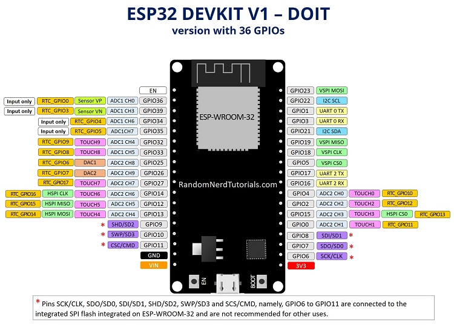
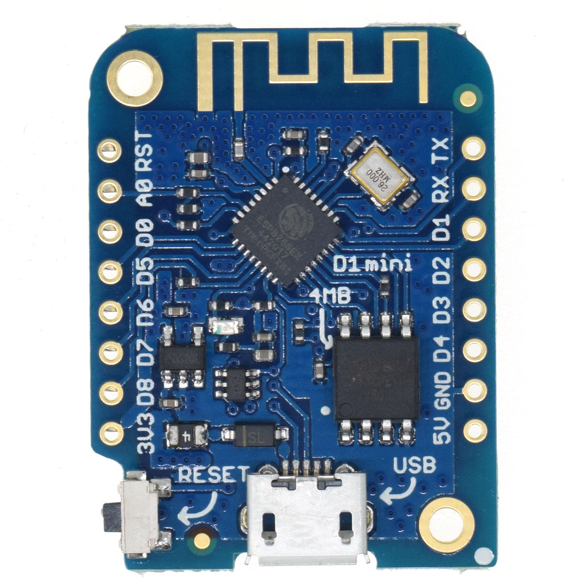

## NodeMCU

for extensive pinout documentations see [pinout reference](https://randomnerdtutorials.com/esp32-pinout-reference-gpios/)

## Wemos D1

ESP8266 based board.

[full docs](https://www.wemos.cc/en/latest/d1/d1_mini.html)

{width=50%}
